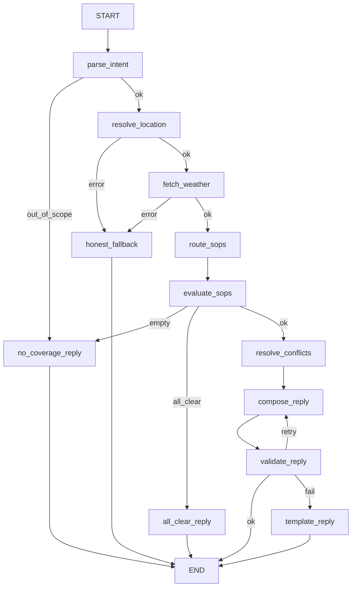

# Weather-Advisory Support Bot

A LangGraph-based chatbot designed to answer outdoor-activity safety questions (e.g., "is it safe to cycle in Bhopal today?") using live Open-Meteo weather data. Every piece of advice provided by the bot is strictly derived from a written SOP (Standard Operating Procedure) policy file, ensuring that the business controls the safety rules, not the LLM.

## Setup and Run

1. **Install Dependencies**:
   Ensure you have Python 3.11+.
   ```bash
   pip install -r requirements.txt
   ```

2. **Environment Variables**:
   Create a `.env` file from the example:
   ```env
   LLM_PROVIDER=google_genai
   LLM_MODEL=your_model_name_here
   GOOGLE_API_KEY=your_primary_api_key_here
   GOOGLE_API_KEY_FALLBACK=your_fallback_api_key_here
   LLM_MODEL_FALLBACK=your_fallback_model_name_here
   WEATHER_MODE=live
   SOP_DIR=sops
   ```
   *Note: `GOOGLE_API_KEY_FALLBACK` and `LLM_MODEL_FALLBACK` are optional. If set, any failure (e.g., rate limit) on the primary model automatically fails over to the fallback model.*

3. **Run the App**:
   ```bash
   uvicorn app.main:app --host 0.0.0.0 --port 8000
   ```
   Access the minimal chat UI at `http://localhost:8000`.

## Architecture: Node and Branch Diagram



## SOP Schema & Adding an 11th SOP

SOPs are written in YAML and loaded dynamically. To add an 11th SOP, simply drop a new YAML file into the `sops/` directory. **No code changes are required.**

**Schema**:
```yaml
id: UNIQUE-ID-01
title: Short Title
category: outdoor_exercise
severity: high # info | low | moderate | high | critical
description: Plain-English intent for the semantic router.
applies_to: [cycling, running] # Use fixed vocabulary or ["*"]
lead_with: false # true => bypasses severity to be ranked first
overrides_scope: false # true => triggers on any activity
conditions:
  all:
    - {field: wind_gusts_10m, agg: max, scope: window, op: ">=", value: 40}
  any: []
advice: The exact text the user will see if this SOP is matched.
```

## Conflict Policy

If multiple SOPs trigger:
1. They are sorted by `severity` (critical > high > moderate > low > info).
2. SOPs marked `lead_with: true` are boosted to the very top.
3. The LLM is instructed to lead its reply with the #1 ranked SOP, and can mention up to 2 others as "also" warnings.
*Rationale: User safety is maximized by immediately presenting the most critical risk without omitting secondary warnings.*

## Code vs. LLM Responsibilities

**Deterministic Code Decides**:
- Geocoding and Location errors
- Weather API fetches and failures
- Which conditions are actually true (strict numerical evaluation against thresholds)
- Severity ranking and conflict resolution
- Number grounding validation and fallback templates

**LLM Decides Only**:
- Extracting intent (location, activity, target day) from the user's unstructured message.
- Semantic routing (guessing which SOPs *might* be relevant from a fixed list of IDs).
- Phrasing and wording the final reply strictly using the provided facts and advice texts.

## How the Validator Works
The `validate_reply` node protects against LLM hallucinations:
1. **Citations**: Verifies using regex that every `SOP-ID` the LLM mentions was actually matched by the deterministic evaluator.
2. **Numbers**: Extracts all floats from the LLM's text and compares them numerically (`80 == 80.0`, no tolerance) against the exact API facts *and* the numeric thresholds written in the matched SOP advice rules. If an invented number is found, it rejects the reply.
3. **Retry & Template**: On failure, the graph loops back for 1 retry. If it fails again, it abandons the LLM and falls back to a deterministic, code-assembled `template_reply` that guarantees safe advice delivery.

## Failure Behavior
- **API Outages**: If the weather or geocoding API fails, the graph immediately shunts to an `honest_fallback` ("Sorry, I couldn't get the weather data"), never guessing safety.
- **LLM API Fallbacks & Failures**: The system wraps LangChain's native `with_fallbacks` logic across all LLM interactions (`parse_intent`, `route_sops`, `compose_reply`). If the primary LLM model fails (e.g., 429 quota exhaustion or 500 server error), it instantly retries using the fallback model if configured. If BOTH models fail, it gracefully routes to a `service_unavailable_reply`.
- **Out of Scope**: Triggers `no_coverage_reply` ("We don't have guidance for that").
- **LLM Outages/Validation Failures**: Triggers the `template_reply` to stitch together the matched SOP advice lines programmatically.

## How to Run Evals
Evals run the bot through deterministic fixtures to verify rules and fallbacks.
```bash
python evals/run_evals.py
```
This generates `evals/RESULTS.md` with 3 iterations per case to ensure LLM stability.

## Honest Known Gaps
- **Synthetic Fixtures**: The `heavy_rain` and `windy` cases in the eval suite are synthetic edits of a normal day to force edge cases for deterministic testing.
- **Live API Unasserted**: We cannot assert strict numbers on live weather eval runs since Open-Meteo forecasts fluctuate constantly; we evaluate rule triggers instead.
- **Router is Recall-Only**: The LLM semantic router is not a safety gate. It can only *add* candidate SOPs. The evaluator checks all SOPs that match the user's activity tag regardless of the router.
- **Latency Tradeoff**: The system uses `gemini-3.5-flash` to prioritize speed over deep-reasoning, trading conversational nuance for sub-3-second responses.
- **Generic SOPs**: Some default SOPs are generally scoped and not heavily tuned to India-specific climate realities (e.g., IMD severity bands).

## Known gaps
- **Latency**: The thinking level is currently left at the model default, which can add latency for `parse_intent` and `route_sops`; a future step would be setting a low thinking level specifically for these rapid tasks.
