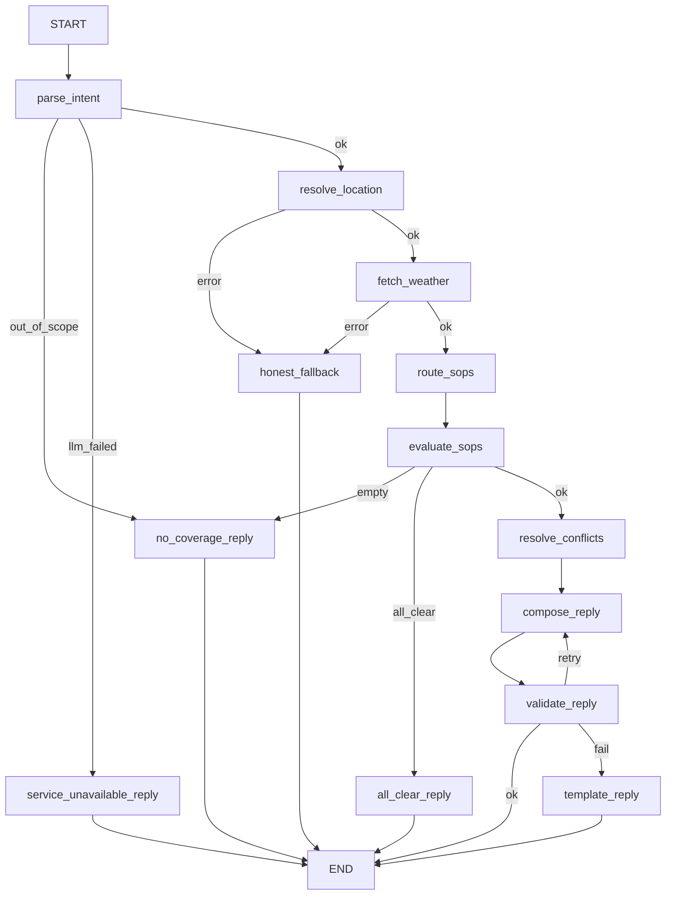

# Weather-Advisory Support Bot

A LangGraph-based chatbot that answers outdoor-activity safety questions (e.g., *"is it safe to cycle in Bhopal today?"*) using live Open-Meteo weather data. Every piece of advice is strictly derived from a written SOP (Standard Operating Procedure) YAML file — the LLM only extracts intent and phrases the reply, never invents safety advice.

---

## Quick Setup & Run (5 minutes)

### 1. Clone and create virtual environment
```bash
git clone https://github.com/wadhwaumeshzira/Brainwave-weather-advisory-bot.git
cd Brainwave-weather-advisory-bot

python -m venv .venv

# Windows
.\.venv\Scripts\Activate.ps1

# Mac/Linux
source .venv/bin/activate
```

### 2. Install dependencies
```bash
pip install -r requirements.txt
```

### 3. Create your `.env` file
```bash
cp .env.example .env
```
Then open `.env` and fill in your API key. **Groq is recommended** (free, fastest):
- Get a free Groq key at: https://console.groq.com/keys

```env
LLM_PROVIDER=groq
LLM_MODEL=openai/gpt-oss-120b
GROQ_API_KEY=your_groq_key_here
WEATHER_MODE=live
SOP_DIR=sops
```

### 4. Start the server
```bash
uvicorn app.main:app --reload
```
Open **http://localhost:8000** in your browser — the chat UI will appear.

### 5. Run the eval suite
```bash
python evals/run_evals.py --runs 1
```
Results are written to `evals/RESULTS.md`. Use `--runs 3` for the full stochastic sweep.

### 6. Run unit tests
```bash
pytest tests/ -v
```
All 54 tests should pass (no API key required — tests use mocks and fixtures).

---

## Architecture: Node and Branch Diagram



---

## Adding an 11th SOP (no code changes needed)

Simply drop a new `.yaml` file into the `sops/` directory. The bot picks it up on restart. Example schema:

```yaml
id: UNIQUE-ID-01
title: Short Title
category: outdoor_exercise
severity: high          # info | low | moderate | high | critical
description: Plain-English intent used by the semantic router.
applies_to: [cycling]   # fixed vocabulary list, or ["*"] for all activities
lead_with: false        # true => ranked first regardless of severity
overrides_scope: false  # true => triggers on any activity query
conditions:
  all:
    - {field: wind_gusts_10m, agg: max, scope: window, op: ">=", value: 40}
  any: []
  n_of: null
advice: "The exact text shown to the user if this SOP matches."
facts_used: [wind_gusts_10m]  # fields the reply is allowed to quote
```

**Condition field scopes:**
- `current` → from `current.*` API fields
- `window` → hourly slice within `time_window.start_hour`–`end_hour`
- `today` / `tomorrow` → from `daily.*` fields
- `next_6h` → next 6 hourly slots from now

---

## Conflict Resolution Policy

When multiple SOPs trigger for the same question:
1. Sorted by `severity` (critical > high > moderate > low > info)
2. SOPs with `lead_with: true` are boosted to rank #1
3. The LLM leads the reply with the top SOP and mentions up to 2 more as secondary warnings

*Rationale: the user's safety is best served by seeing the worst risk first without hiding secondary risks.*

---

## Deterministic vs LLM Split

**Deterministic code decides:**
- Geocoding and location resolution
- Weather API fetches and failures
- Which SOP conditions are true (strict numerical evaluation)
- Severity ranking and conflict resolution
- Number grounding validation (`80 == 80.0`, no tolerance)
- Template fallback reply when LLM fails

**LLM decides only:**
- Extracting intent (location, activity, target day) from free-text
- Semantic routing — which SOP IDs *might* be relevant (recall-only, not a gate)
- Wording the final reply using only the matched SOP advice + fetched facts

---

## Validator (Hallucination Guard)

The `validate_reply` node runs after every LLM compose:
1. **Citation check** — every SOP ID in the reply must be in the matched set
2. **Number grounding** — every float in the reply must appear in the live weather facts dict OR in the matched SOP's condition thresholds. Invented or rounded numbers are rejected.
3. **Retry + template fallback** — on failure, 1 retry. If it fails again, a deterministic code-built reply is sent instead (guaranteed safe, no hallucination).

---

## Failure Behaviour

| Situation | Node | Result |
|-----------|------|--------|
| Location not found or geocoding error | `honest_fallback` | "Sorry, I couldn't resolve that location." |
| Weather API down or timeout | `honest_fallback` | "Sorry, I couldn't get weather data." |
| Question out of scope | `no_coverage_reply` | "We don't have guidance for that." |
| No SOP matches conditions | `no_coverage_reply` | "No policy covers this today." |
| LLM reply fails validation twice | `template_reply` | Code-built reply using matched SOP advice + facts |
| Both primary and fallback LLM fail | `service_unavailable_reply` | "AI service temporarily unavailable." |

---

## Eval Suite

The eval suite at `evals/run_evals.py` covers:

| # | Type | What it checks |
|---|------|----------------|
| 1–2 | SOP clearly applies | Correct SOP cited, numbers from live API |
| 3–4 | Paraphrased intent | Matching without keyword overlap |
| 5 | Severe conditions | Regime SOP fires on heavy-rain fixture |
| 6 | Conflict resolution | Both SOPs cited, regime first |
| 7 | No SOP applies | "no guidance" reply |
| 8 | Weather API failure | `honest_fallback` fires |
| 9 | Location failure | `honest_fallback` fires |
| 10 | Hinglish query | Activity correctly mapped |
| 11 | Session memory | Follow-up reuses context |
| 12–13 | Adversarial prompt injection | SOP-999 not cited, safety not claimed |
| 14–16 | Additional edge cases | All-clear, validator grounding |

Live weather varies — the heavy-rain cases use a synthetic fixture so the eval is deterministic regardless of today's forecast.

---

## Known Gaps

- **Thinking latency**: Thinking level is left at model default for `parse_intent` and `route_sops`, which can add latency. A future step would be setting a low thinking budget for these rapid classification tasks.
- **India-specific SOPs**: SOPs are not deeply tuned to IMD severity bands or regional climate patterns.
- **Synthetic fixtures**: `heavy_rain` and `windy` evals use edited JSON fixtures to force edge cases deterministically. Live API numbers fluctuate and cannot be exactly asserted.
- **Router is recall-only**: The LLM semantic router can only *add* candidate SOPs. The deterministic evaluator checks all activity-matching SOPs regardless of the router's output.
